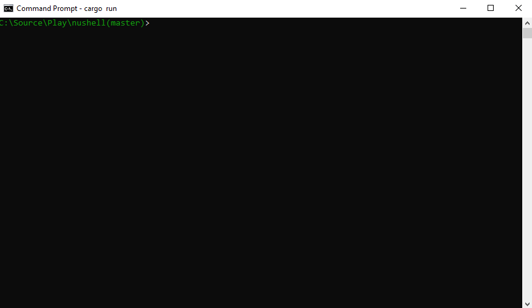

[](https://crates.io/crates/nu)
[](https://dev.azure.com/nushell/nushell/_build/latest?definitionId=2&branchName=master)
[](https://discord.gg/NtAbbGn)
[](https://changelog.com/podcast/363)


# Nu Shell

A modern shell for the GitHub era.



# Status

This project has reached a minimum-viable product level of quality. While contributors dogfood it as their daily driver, it may be unstable for some commands. Future releases will work to fill out missing features and improve stability. Its design is also subject to change as it matures.

Nu comes with a set of built-in commands (listed below). If a command is unknown, the command will shell-out and execute it (using cmd on Windows or bash on Linux and macOS), correctly passing through stdin, stdout, and stderr, so things like your daily git workflows and even `vim` will work just fine.

# Learning more

There are a few good resources to learn about Nu. There is a [book](https://www.nushell.sh/book/) about Nu that is currently in progress. The book focuses on using Nu and its core concepts.

If you're a developer who would like to contribute to Nu, we're also working on a [book for developers](https://www.nushell.sh/contributor-book/) to help you get started. There are also [good first issues](https://github.com/nushell/nushell/issues?q=is%3Aopen+is%3Aissue+label%3A%22good+first+issue%22) to help you dive in.

We also have an active [Discord](https://discord.gg/NtAbbGn) and [Twitter](https://twitter.com/nu_shell) if you'd like to come and chat with us.

Try it in Gitpod.

[](https://gitpod.io/#https://github.com/nushell/nushell)

# Installation

## Local

Up-to-date installation instructions can be found in the [installation chapter of the book](https://www.nushell.sh/book/en/installation.html).  **Windows users**: please note that Nu works on Windows 10 and does not currently have Windows 7/8.1 support.

To build Nu, you will need to use the **latest stable (1.39 or later)** version of the compiler.

Required dependencies:

* pkg-config and libssl (only needed on Linux)
  * on Debian/Ubuntu: `apt install pkg-config libssl-dev`

Optional dependencies:

* To use Nu with all possible optional features enabled, you'll also need the following:
  * on Linux (on Debian/Ubuntu): `apt install libxcb-composite0-dev libx11-dev`

To install Nu via cargo (make sure you have installed [rustup](https://rustup.rs/) and the latest stable compiler via `rustup install stable`):

```
cargo install nu
```

You can also build Nu yourself with all the bells and whistles (be sure to have installed the [dependencies](https://www.nushell.sh/book/en/installation.html#dependencies) for your platform), once you have checked out this repo with git:

```
cargo build --all --features=stable
```

## Docker

If you want to pull a pre-built container, you can browse tags for the [nushell organization](https://quay.io/organization/nushell)
on Quay.io. Pulling a container would come down to:

```bash
$ docker pull quay.io/nushell/nu
$ docker pull quay.io/nushell/nu-base
```

Both "nu-base" and "nu" provide the nu binary, however nu-base also includes the source code at `/code`
in the container and all dependencies.

Optionally, you can also build the containers locally using the [dockerfiles provided](docker):
To build the base image:

```bash
$ docker build -f docker/Dockerfile.nu-base -t nushell/nu-base .
```

And then to build the smaller container (using a Multistage build):

```bash
$ docker build -f docker/Dockerfile -t nushell/nu .
```

Either way, you can run either container as follows:

```bash
$ docker run -it nushell/nu-base
$ docker run -it nushell/nu
/> exit
```

The second container is a bit smaller if the size is important to you.

## Packaging status

[](https://repology.org/project/nushell/versions)

### Fedora

[COPR repo](https://copr.fedorainfracloud.org/coprs/atim/nushell/): `sudo dnf copr enable atim/nushell -y && sudo dnf install nushell -y`

# Philosophy

Nu draws inspiration from projects like PowerShell, functional programming languages, and modern CLI tools. Rather than thinking of files and services as raw streams of text, Nu looks at each input as something with structure. For example, when you list the contents of a directory, what you get back is a table of rows, where each row represents an item in that directory. These values can be piped through a series of steps, in a series of commands called a 'pipeline'.

## Pipelines

In Unix, it's common to pipe between commands to split up a sophisticated command over multiple steps. Nu takes this a step further and builds heavily on the idea of _pipelines_. Just as the Unix philosophy, Nu allows commands to output from stdout and read from stdin. Additionally, commands can output structured data (you can think of this as a third kind of stream). Commands that work in the pipeline fit into one of three categories:

* Commands that produce a stream (eg, `ls`)
* Commands that filter a stream (eg, `where type == "Directory"`)
* Commands that consume the output of the pipeline (eg, `autoview`)

Commands are separated by the pipe symbol (`|`) to denote a pipeline flowing left to right.

```
/home/jonathan/Source/nushell(master)> ls | where type == "Directory" | autoview
────┬───────────┬───────────┬──────────┬────────┬──────────────┬────────────────
 #  │ name      │ type      │ readonly │ size   │ accessed     │ modified
────┼───────────┼───────────┼──────────┼────────┼──────────────┼────────────────
  0 │ .azure    │ Directory │          │ 4.1 KB │ 2 months ago │ a day ago
  1 │ target    │ Directory │          │ 4.1 KB │ 3 days ago   │ 3 days ago
  2 │ images    │ Directory │          │ 4.1 KB │ 2 months ago │ 2 weeks ago
  3 │ tests     │ Directory │          │ 4.1 KB │ 2 months ago │ 37 minutes ago
  4 │ tmp       │ Directory │          │ 4.1 KB │ 2 weeks ago  │ 2 weeks ago
  5 │ src       │ Directory │          │ 4.1 KB │ 2 months ago │ 37 minutes ago
  6 │ assets    │ Directory │          │ 4.1 KB │ a month ago  │ a month ago
  7 │ docs      │ Directory │          │ 4.1 KB │ 2 months ago │ 2 months ago
────┴───────────┴───────────┴──────────┴────────┴──────────────┴────────────────
```

Because most of the time you'll want to see the output of a pipeline, `autoview` is assumed. We could have also written the above:

```
/home/jonathan/Source/nushell(master)> ls | where type == Directory
```

Being able to use the same commands and compose them differently is an important philosophy in Nu. For example, we could use the built-in `ps` command as well to get a list of the running processes, using the same `where` as above.

```text
/home/jonathan/Source/nushell(master)> ps | where cpu > 0
───┬───────┬─────────────────┬──────────┬──────────
 # │ pid   │ name            │ status   │ cpu
───┼───────┼─────────────────┼──────────┼──────────
 0 │   992 │ chrome          │ Sleeping │ 6.988768
 1 │  4240 │ chrome          │ Sleeping │ 5.645982
 2 │ 13973 │ qemu-system-x86 │ Sleeping │ 4.996551
 3 │ 15746 │ nu              │ Sleeping │ 84.59905
───┴───────┴─────────────────┴──────────┴──────────
```

## Opening files

Nu can load file and URL contents as raw text or as structured data (if it recognizes the format). For example, you can load a .toml file as structured data and explore it:

```
/home/jonathan/Source/nushell(master)> open Cargo.toml
──────────────────┬────────────────┬──────────────────
 bin              │ dependencies   │ dev-dependencies
──────────────────┼────────────────┼──────────────────
 [table: 12 rows] │ [table: 1 row] │ [table: 1 row]
──────────────────┴────────────────┴──────────────────
```

We can pipeline this into a command that gets the contents of one of the columns:

```
/home/jonathan/Source/nushell(master)> open Cargo.toml | get package
─────────────────┬────────────────────────────┬─────────┬─────────┬──────┬─────────
 authors         │ description                │ edition │ license │ name │ version
─────────────────┼────────────────────────────┼─────────┼─────────┼──────┼─────────
 [table: 3 rows] │ A shell for the GitHub era │ 2018    │ MIT     │ nu   │ 0.8.0
─────────────────┴────────────────────────────┴─────────┴─────────┴──────┴─────────
```

Finally, we can use commands outside of Nu once we have the data we want:

```
/home/jonathan/Source/nushell(master)> open Cargo.toml | get package.version | echo $it
0.8.0
```

Here we use the variable `$it` to refer to the value being piped to the external command.

## Configuration

Nu has early support for configuring the shell. It currently supports the following settings:

| Variable        | Type           | Description  |
| ------------- | ------------- | ----- |
| path | table of strings | PATH to use to find binaries |
| env | row | the environment variables to pass to external commands |
| ctrlc_exit | boolean | whether or not to exit Nu after multiple ctrl-c presses |
| table_mode | "light" or other | enable lightweight or normal tables |
| edit_mode | "vi" or "emacs" | changes line editing to "vi" or "emacs" mode |

To set one of these variables, you can use `config --set`. For example:

```
> config --set [edit_mode "vi"]
> config --set [path $nu.path]
```

## Shells

Nu will work inside of a single directory and allow you to navigate around your filesystem by default. Nu also offers a way of adding additional working directories that you can jump between, allowing you to work in multiple directories at the same time.

To do so, use the `enter` command, which will allow you create a new "shell" and enter it at the specified path. You can toggle between this new shell and the original shell with the `p` (for previous) and `n` (for next), allowing you to navigate around a ring buffer of shells. Once you're done with a shell, you can `exit` it and remove it from the ring buffer.

Finally, to get a list of all the current shells, you can use the `shells` command.

## Plugins

Nu supports plugins that offer additional functionality to the shell and follow the same structured data model that built-in commands use. This allows you to extend nu for your needs.

There are a few examples in the `plugins` directory.

Plugins are binaries that are available in your path and follow a `nu_plugin_*` naming convention. These binaries interact with nu via a simple JSON-RPC protocol where the command identifies itself and passes along its configuration, which then makes it available for use. If the plugin is a filter, data streams to it one element at a time, and it can stream data back in return via stdin/stdout. If the plugin is a sink, it is given the full vector of final data and is given free reign over stdin/stdout to use as it pleases.

# Goals

Nu adheres closely to a set of goals that make up its design philosophy. As features are added, they are checked against these goals.

* First and foremost, Nu is cross-platform. Commands and techniques should carry between platforms and offer first-class consistent support for Windows, macOS, and Linux.

* Nu ensures direct compatibility with existing platform-specific executables that make up people's workflows.

* Nu's workflow and tools should have the usability in day-to-day experience of using a shell in 2019 (and beyond).

* Nu views data as both structured and unstructured. It is a structured shell like PowerShell.

* Finally, Nu views data functionally. Rather than using mutation, pipelines act as a means to load, change, and save data without mutable state.

# Commands
## Initial commands
| command | description |
| ------------- | ------------- |
| cd path | Change to a new path |
| cp source path | Copy files |
| date (--utc) | Get the current datetime |
| fetch url | Fetch contents from a url and retrieve data as a table if possible |
| help | Display help information about commands |
| ls (path) | View the contents of the current or given path |
| mkdir path | Make directories, creates intermediary directories as required. |
| mv source target | Move files or directories. |
| open filename | Load a file into a cell, convert to table if possible (avoid by appending '--raw') |
| post url body (--user <user>) (--password <password>) | Post content to a url and retrieve data as a table if possible |
| ps | View current processes |
| sys | View information about the current system |
| which filename | Finds a program file. |
| rm   {file or directory} | Remove a file, (for removing directory append '--recursive') |
| version | Display Nu version |

## Shell commands
| command | description |
| ------- | ----------- |
| exit (--now) | Exit the current shell (or all shells) |
| enter (path) | Create a new shell and begin at this path |
| p | Go to previous shell |
| n | Go to next shell |
| shells | Display the list of current shells |

## Filters on tables (structured data)
| command | description |
| ------------- | ------------- |
| append row-data | Append a row to the end of the table |
| compact ...columns | Remove rows where given columns are empty |
| count | Show the total number of rows |
| default column row-data | Sets a default row's column if missing |
| edit column-or-column-path value | Edit an existing column to have a new value |
| embed column | Creates a new table of one column with the given name, and places the current table inside of it |
| first amount | Show only the first number of rows |
| format pattern | Format table row data as a string following the given pattern |
| get column-or-column-path | Open column and get data from the corresponding cells |
| group-by column | Creates a new table with the data from the table rows grouped by the column given |
| histogram column ...column-names | Creates a new table with a histogram based on the column name passed in, optionally give the frequency column name
| inc (column-or-column-path) | Increment a value or version. Optionally use the column of a table |
| insert column-or-column-path value | Insert a new column to the table |
| last amount | Show only the last number of rows |
| nth ...row-numbers | Return only the selected rows |
| pick ...columns | Down-select table to only these columns |
| pivot --header-row <headers> | Pivot the tables, making columns into rows and vice versa |
| prepend row-data | Prepend a row to the beginning of the table |
| reject ...columns | Remove the given columns from the table |
| reverse | Reverses the table. |
| skip amount | Skip a number of rows |
| skip-while condition | Skips rows while the condition matches |
| split-by column | Creates a new table with the data from the inner tables splitted by the column given |
| sort-by ...columns | Sort by the given columns |
| str (column) | Apply string function. Optionally use the column of a table |
| sum | Sum a column of values |
| tags | Read the tags (metadata) for values |
| to-bson | Convert table into .bson binary data |
| to-csv | Convert table into .csv text |
| to-json | Convert table into .json text |
| to-sqlite | Convert table to sqlite .db binary data |
| to-toml | Convert table into .toml text |
| to-tsv | Convert table into .tsv text |
| to-url | Convert table to a urlencoded string |
| to-yaml | Convert table into .yaml text |
| where condition | Filter table to match the condition |

## Filters on text (unstructured data)
| command | description |
| ------------- | ------------- |
| from-bson | Parse binary data as .bson and create table |
| from-csv | Parse text as .csv and create table |
| from-ini | Parse text as .ini and create table |
| from-json | Parse text as .json and create table |
| from-sqlite | Parse binary data as sqlite .db and create table |
| from-ssv --minimum-spaces <minimum number of spaces to count as a separator> | Parse text as space-separated values and create table |
| from-toml | Parse text as .toml and create table |
| from-tsv  | Parse text as .tsv and create table  |
| from-url | Parse urlencoded string and create a table |
| from-xml | Parse text as .xml and create a table |
| from-yaml | Parse text as a .yaml/.yml and create a table |
| lines | Split single string into rows, one per line |
| parse pattern | Convert text to a table by matching the given pattern |
| size | Gather word count statistics on the text |
| split-column sep ...column-names | Split row contents across multiple columns via the separator, optionally give the columns names |
| split-row sep | Split row contents over multiple rows via the separator |
| trim | Trim leading and following whitespace from text data |
| {external-command} $it | Run external command with given arguments, replacing $it with each row text |

## Consuming commands
| command | description |
| ------------- | ------------- |
| autoview | View the contents of the pipeline as a table or list |
| binaryview | Autoview of binary data (optional feature) |
| clip | Copy the contents of the pipeline to the copy/paste buffer (optional feature) |
| save filename | Save the contents of the pipeline to a file |
| table | View the contents of the pipeline as a table |
| textview | Autoview of text data |
| tree | View the contents of the pipeline as a tree (optional feature) |

# License

The project is made available under the MIT license. See "LICENSE" for more information.

