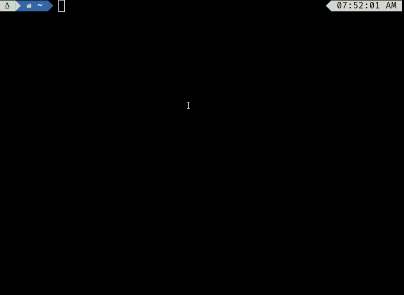

# Nushell <!-- omit in toc -->
[](https://crates.io/crates/nu)

[](https://discord.gg/NtAbbGn)
[](https://changelog.com/podcast/363)
[](https://twitter.com/nu_shell)


A new type of shell.



## Table of Contents <!-- omit in toc -->

- [Status](#status)
- [Learning About Nu](#learning-about-nu)
- [Installation](#installation)
- [Philosophy](#philosophy)
  - [Pipelines](#pipelines)
  - [Opening files](#opening-files)
  - [Plugins](#plugins)
- [Goals](#goals)
- [Progress](#progress)
- [Officially Supported By](#officially-supported-by)
- [Contributing](#contributing)
- [License](#license)

## Status

This project has reached a minimum-viable-product level of quality. Many people use it as their daily driver, but it may be unstable for some commands. Nu's design is subject to change as it matures.

## Learning About Nu

The [Nushell book](https://www.nushell.sh/book/) is the primary source of Nushell documentation. You can find [a full list of Nu commands in the book](https://www.nushell.sh/book/command_reference.html), and we have many examples of using Nu in our [cookbook](https://www.nushell.sh/cookbook/).

We're also active on [Discord](https://discord.gg/NtAbbGn) and [Twitter](https://twitter.com/nu_shell); come and chat with us!

## Installation

To quickly install Nu:

```bash
# Linux and macOS
brew install nushell
# Windows
winget install nushell
```

To use `Nu` in Github Action, check [setup-nu](https://github.com/marketplace/actions/setup-nu) for more detail.

Detailed installation instructions can be found in the [installation chapter of the book](https://www.nushell.sh/book/installation.html). Nu is available via many package managers:

[](https://repology.org/project/nushell/versions)


## Philosophy

Nu draws inspiration from projects like PowerShell, functional programming languages, and modern CLI tools.
Rather than thinking of files and data as raw streams of text, Nu looks at each input as something with structure.
For example, when you list the contents of a directory what you get back is a table of rows, where each row represents an item in that directory.
These values can be piped through a series of steps, in a series of commands called a 'pipeline'.

### Pipelines

In Unix, it's common to pipe between commands to split up a sophisticated command over multiple steps.
Nu takes this a step further and builds heavily on the idea of _pipelines_.
As in the Unix philosophy, Nu allows commands to output to stdout and read from stdin.
Additionally, commands can output structured data (you can think of this as a third kind of stream).
Commands that work in the pipeline fit into one of three categories:

-   Commands that produce a stream (e.g., `ls`)
-   Commands that filter a stream (e.g., `where type == "dir"`)
-   Commands that consume the output of the pipeline (e.g., `table`)

Commands are separated by the pipe symbol (`|`) to denote a pipeline flowing left to right.

```shell
> ls | where type == "dir" | table
╭────┬──────────┬──────┬─────────┬───────────────╮
│ #  │   name   │ type │  size   │   modified    │
├────┼──────────┼──────┼─────────┼───────────────┤
│  0 │ .cargo   │ dir  │     0 B │ 9 minutes ago │
│  1 │ assets   │ dir  │     0 B │ 2 weeks ago   │
│  2 │ crates   │ dir  │ 4.0 KiB │ 2 weeks ago   │
│  3 │ docker   │ dir  │     0 B │ 2 weeks ago   │
│  4 │ docs     │ dir  │     0 B │ 2 weeks ago   │
│  5 │ images   │ dir  │     0 B │ 2 weeks ago   │
│  6 │ pkg_mgrs │ dir  │     0 B │ 2 weeks ago   │
│  7 │ samples  │ dir  │     0 B │ 2 weeks ago   │
│  8 │ src      │ dir  │ 4.0 KiB │ 2 weeks ago   │
│  9 │ target   │ dir  │     0 B │ a day ago     │
│ 10 │ tests    │ dir  │ 4.0 KiB │ 2 weeks ago   │
│ 11 │ wix      │ dir  │     0 B │ 2 weeks ago   │
╰────┴──────────┴──────┴─────────┴───────────────╯
```

Because most of the time you'll want to see the output of a pipeline, `table` is assumed.
We could have also written the above:

```shell
> ls | where type == "dir"
```

Being able to use the same commands and compose them differently is an important philosophy in Nu.
For example, we could use the built-in `ps` command to get a list of the running processes, using the same `where` as above.

```shell
> ps | where cpu > 0
╭───┬───────┬───────────┬───────┬───────────┬───────────╮
│ # │  pid  │   name    │  cpu  │    mem    │  virtual  │
├───┼───────┼───────────┼───────┼───────────┼───────────┤
│ 0 │  2240 │ Slack.exe │ 16.40 │ 178.3 MiB │ 232.6 MiB │
│ 1 │ 16948 │ Slack.exe │ 16.32 │ 205.0 MiB │ 197.9 MiB │
│ 2 │ 17700 │ nu.exe    │  3.77 │  26.1 MiB │   8.8 MiB │
╰───┴───────┴───────────┴───────┴───────────┴───────────╯
```

### Opening files

Nu can load file and URL contents as raw text or structured data (if it recognizes the format).
For example, you can load a .toml file as structured data and explore it:

```shell
> open Cargo.toml
╭──────────────────┬────────────────────╮
│ bin              │ [table 1 row]      │
│ dependencies     │ {record 24 fields} │
│ dev-dependencies │ {record 8 fields}  │
│ features         │ {record 10 fields} │
│ package          │ {record 13 fields} │
│ profile          │ {record 3 fields}  │
│ target           │ {record 2 fields}  │
│ workspace        │ {record 1 field}   │
╰──────────────────┴────────────────────╯
```

We can pipe this into a command that gets the contents of one of the columns:

```shell
> open Cargo.toml | get package
╭───────────────┬────────────────────────────────────╮
│ authors       │ [list 1 item]                      │
│ default-run   │ nu                                 │
│ description   │ A new type of shell                │
│ documentation │ https://www.nushell.sh/book/       │
│ edition       │ 2018                               │
│ exclude       │ [list 1 item]                      │
│ homepage      │ https://www.nushell.sh             │
│ license       │ MIT                                │
│ name          │ nu                                 │
│ readme        │ README.md                          │
│ repository    │ https://github.com/nushell/nushell │
│ rust-version  │ 1.60                               │
│ version       │ 0.63.1                             │
╰───────────────┴────────────────────────────────────╯
```

And if needed we can drill down further:

```shell
> open Cargo.toml | get package.version
0.63.1
```

### Plugins

Nu supports plugins that offer additional functionality to the shell and follow the same structured data model that built-in commands use. There are a few examples in the `crates/nu_plugins_*` directories.

Plugins are binaries that are available in your path and follow a `nu_plugin_*` naming convention.
These binaries interact with nu via a simple JSON-RPC protocol where the command identifies itself and passes along its configuration, making it available for use.
If the plugin is a filter, data streams to it one element at a time, and it can stream data back in return via stdin/stdout.
If the plugin is a sink, it is given the full vector of final data and is given free reign over stdin/stdout to use as it pleases.

## Goals

Nu adheres closely to a set of goals that make up its design philosophy. As features are added, they are checked against these goals.

-   First and foremost, Nu is cross-platform. Commands and techniques should work across platforms and Nu has first-class support for Windows, macOS, and Linux.

-   Nu ensures compatibility with existing platform-specific executables.

-   Nu's workflow and tools should have the usability expected of modern software in 2022 (and beyond).

-   Nu views data as either structured or unstructured. It is a structured shell like PowerShell.

-   Finally, Nu views data functionally. Rather than using mutation, pipelines act as a means to load, change, and save data without mutable state.

## Progress

Nu is under heavy development and will naturally change as it matures. The chart below isn't meant to be exhaustive, but it helps give an idea for some of the areas of development and their relative maturity:

| Features      | Not started | Prototype | MVP | Preview | Mature | Notes                                                                |
| ------------- | :---------: | :-------: | :-: | :-----: | :----: | -------------------------------------------------------------------- |
| Aliases       |             |           |     |    X    |        | Aliases allow for shortening large commands, while passing flags     |
| Notebook      |             |     X     |     |         |        | Initial jupyter support, but it loses state and lacks features       |
| File ops      |             |           |     |    X    |        | cp, mv, rm, mkdir have some support, but lacking others              |
| Environment   |             |           |     |    X    |        | Temporary environment and scoped environment variables               |
| Shells        |             |           |     |    X    |        | Basic value and file shells, but no opt-in/opt-out for commands      |
| Protocol      |             |           |     |    X    |        | Streaming protocol is serviceable                                    |
| Plugins       |             |           |  X  |         |        | Plugins work on one row at a time, lack batching and expression eval |
| Errors        |             |           |     |    X    |        | Error reporting works, but could use usability polish                |
| Documentation |             |           |  X  |         |        | Book updated to latest release, including usage examples             |
| Paging        |             |           |     |    X    |        | Textview has paging, but we'd like paging for tables                 |
| Functions     |             |           |     |    X    |        | Functions and aliases are supported                                  |
| Variables     |             |           |     |    X    |        | Nu supports variables and environment variables                      |
| Completions   |             |           |     |    X    |        | Completions for filepaths                                            |
| Type-checking |             |           |     |    x    |        | Commands check basic types, and input/output types                   |

## Officially Supported By

Please submit an issue or PR to be added to this list.

-   [zoxide](https://github.com/ajeetdsouza/zoxide)
-   [starship](https://github.com/starship/starship)
-   [oh-my-posh](https://ohmyposh.dev)
-   [Couchbase Shell](https://couchbase.sh)
-   [virtualenv](https://github.com/pypa/virtualenv)

## Contributing

See [Contributing](CONTRIBUTING.md) for details. Thanks to all the people who already contributed!

<a href="https://github.com/nushell/nushell/graphs/contributors">
  
</a>

## License

The project is made available under the MIT license. See the `LICENSE` file for more information.
