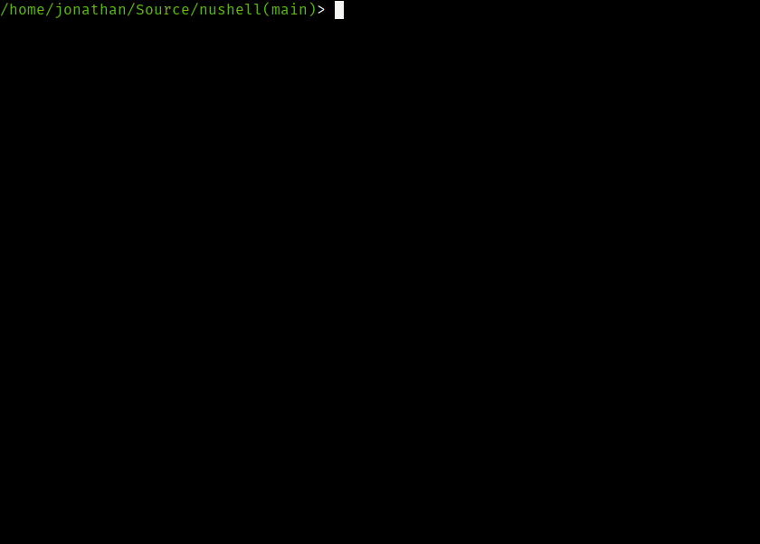

# README

[](https://gitpod.io/#https://github.com/nushell/nushell)
[](https://crates.io/crates/nu)
[](https://dev.azure.com/nushell/nushell/_build/latest?definitionId=2&branchName=master)
[](https://discord.gg/NtAbbGn)
[](https://changelog.com/podcast/363)
[](https://twitter.com/nu_shell)

## Nushell

A new type of shell.



## Status

This project has reached a minimum-viable product level of quality.
While contributors dogfood it as their daily driver, it may be unstable for some commands.
Future releases will work to fill out missing features and improve stability.
Its design is also subject to change as it matures.

Nu comes with a set of built-in commands (listed below).
If a command is unknown, the command will shell-out and execute it (using cmd on Windows or bash on Linux and macOS), correctly passing through stdin, stdout, and stderr, so things like your daily git workflows and even `vim` will work just fine.

## Learning more

There are a few good resources to learn about Nu.
There is a [book](https://www.nushell.sh/book/) about Nu that is currently in progress.
The book focuses on using Nu and its core concepts.

If you're a developer who would like to contribute to Nu, we're also working on a [book for developers](https://www.nushell.sh/contributor-book/) to help you get started.
There are also [good first issues](https://github.com/nushell/nushell/issues?q=is%3Aopen+is%3Aissue+label%3A%22good+first+issue%22) to help you dive in.

We also have an active [Discord](https://discord.gg/NtAbbGn) and [Twitter](https://twitter.com/nu_shell) if you'd like to come and chat with us.

You can also find information on more specific topics in our [cookbook](https://www.nushell.sh/cookbook/).

Try it in Gitpod.

[](https://gitpod.io/#https://github.com/nushell/nushell)

## Installation

### Local

Up-to-date installation instructions can be found in the [installation chapter of the book](https://www.nushell.sh/book/installation.html).  **Windows users**: please note that Nu works on Windows 10 and does not currently have Windows 7/8.1 support.

To build Nu, you will need to use the **latest stable (1.47 or later)** version of the compiler.

Required dependencies:

* pkg-config and libssl (only needed on Linux)
  * On Debian/Ubuntu: `apt install pkg-config libssl-dev`

Optional dependencies:

* To use Nu with all possible optional features enabled, you'll also need the following:
  * On Linux (on Debian/Ubuntu): `apt install libxcb-composite0-dev libx11-dev`

To install Nu via cargo (make sure you have installed [rustup](https://rustup.rs/) and the latest stable compiler via `rustup install stable`):

```bash
cargo install nu
```

You can also build Nu yourself with all the bells and whistles (be sure to have installed the [dependencies](https://www.nushell.sh/book/installation.html#dependencies) for your platform), once you have checked out this repo with git:

```bash
cargo build --workspace --features=extra
```

### Docker

#### Quickstart

Want to try Nu right away? Execute the following to get started.

```bash
docker run -it quay.io/nushell/nu:latest
```

#### Guide

If you want to pull a pre-built container, you can browse tags for the [nushell organization](https://quay.io/organization/nushell)
on Quay.io. Pulling a container would come down to:

```bash
docker pull quay.io/nushell/nu
docker pull quay.io/nushell/nu-base
```

Both "nu-base" and "nu" provide the nu binary, however nu-base also includes the source code at `/code`
in the container and all dependencies.

Optionally, you can also build the containers locally using the [dockerfiles provided](docker):
To build the base image:

```bash
docker build -f docker/Dockerfile.nu-base -t nushell/nu-base .
```

And then to build the smaller container (using a Multistage build):

```bash
docker build -f docker/Dockerfile -t nushell/nu .
```

Either way, you can run either container as follows:

```bash
docker run -it nushell/nu-base
docker run -it nushell/nu
/> exit
```

The second container is a bit smaller if the size is important to you.

### Packaging status

[](https://repology.org/project/nushell/versions)

#### Fedora

[COPR repo](https://copr.fedorainfracloud.org/coprs/atim/nushell/): `sudo dnf copr enable atim/nushell -y && sudo dnf install nushell -y`

## Philosophy

Nu draws inspiration from projects like PowerShell, functional programming languages, and modern CLI tools.
Rather than thinking of files and services as raw streams of text, Nu looks at each input as something with structure.
For example, when you list the contents of a directory, what you get back is a table of rows, where each row represents an item in that directory.
These values can be piped through a series of steps, in a series of commands called a 'pipeline'.

### Pipelines

In Unix, it's common to pipe between commands to split up a sophisticated command over multiple steps.
Nu takes this a step further and builds heavily on the idea of _pipelines_.
Just as the Unix philosophy, Nu allows commands to output from stdout and read from stdin.
Additionally, commands can output structured data (you can think of this as a third kind of stream).
Commands that work in the pipeline fit into one of three categories:

* Commands that produce a stream (eg, `ls`)
* Commands that filter a stream (eg, `where type == "Dir"`)
* Commands that consume the output of the pipeline (eg, `autoview`)

Commands are separated by the pipe symbol (`|`) to denote a pipeline flowing left to right.

```shell
> ls | where type == "Dir" | autoview
───┬────────┬──────┬───────┬──────────────
 # │ name   │ type │ size  │ modified
───┼────────┼──────┼───────┼──────────────
 0 │ assets │ Dir  │ 128 B │ 5 months ago
 1 │ crates │ Dir  │ 704 B │ 50 mins ago
 2 │ debian │ Dir  │ 352 B │ 5 months ago
 3 │ docker │ Dir  │ 288 B │ 3 months ago
 4 │ docs   │ Dir  │ 192 B │ 50 mins ago
 5 │ images │ Dir  │ 160 B │ 5 months ago
 6 │ src    │ Dir  │ 128 B │ 1 day ago
 7 │ target │ Dir  │ 160 B │ 5 days ago
 8 │ tests  │ Dir  │ 192 B │ 3 months ago
───┴────────┴──────┴───────┴──────────────
```

Because most of the time you'll want to see the output of a pipeline, `autoview` is assumed.
We could have also written the above:

```shell
> ls | where type == Dir
```

Being able to use the same commands and compose them differently is an important philosophy in Nu.
For example, we could use the built-in `ps` command as well to get a list of the running processes, using the same `where` as above.

```shell
> ps | where cpu > 0
───┬────────┬───────────────────┬──────────┬─────────┬──────────┬──────────
 # │ pid    │ name              │ status   │ cpu     │ mem      │ virtual
───┼────────┼───────────────────┼──────────┼─────────┼──────────┼──────────
 0 │    435 │ irq/142-SYNA327   │ Sleeping │  7.5699 │      0 B │      0 B
 1 │   1609 │ pulseaudio        │ Sleeping │  6.5605 │  10.6 MB │   2.3 GB
 2 │   1625 │ gnome-shell       │ Sleeping │  6.5684 │ 639.6 MB │   7.3 GB
 3 │   2202 │ Web Content       │ Sleeping │  6.8157 │ 320.8 MB │   3.0 GB
 4 │ 328788 │ nu_plugin_core_ps │ Sleeping │ 92.5750 │   5.9 MB │ 633.2 MB
───┴────────┴───────────────────┴──────────┴─────────┴──────────┴──────────
```

### Opening files

Nu can load file and URL contents as raw text or as structured data (if it recognizes the format).
For example, you can load a .toml file as structured data and explore it:

```shell
> open Cargo.toml
────────────────────┬───────────────────────────
 bin                │ [table 18 rows]
 build-dependencies │ [row serde toml]
 dependencies       │ [row 29 columns]
 dev-dependencies   │ [row nu-test-support]
 features           │ [row 19 columns]
 package            │ [row 12 columns]
 workspace          │ [row members]
────────────────────┴───────────────────────────
```

We can pipeline this into a command that gets the contents of one of the columns:

```shell
> open Cargo.toml | get package
───────────────┬────────────────────────────────────
 authors       │ [table 1 rows]
 default-run   │ nu
 description   │ A new type of shell
 documentation │ https://www.nushell.sh/book/
 edition       │ 2018
 exclude       │ [table 1 rows]
 homepage      │ https://www.nushell.sh
 license       │ MIT
 name          │ nu
 readme        │ README.md
 repository    │ https://github.com/nushell/nushell
 version       │ 0.21.0
───────────────┴────────────────────────────────────
```

Finally, we can use commands outside of Nu once we have the data we want:

```shell
> open Cargo.toml | get package.version
0.21.0
```

Here we use the variable `$it` to refer to the value being piped to the external command.

### Configuration

Nu has early support for configuring the shell. You can refer to the book for a list of [all supported variables](https://www.nushell.sh/book/configuration.html).

To set one of these variables, you can use `config set`. For example:

```shell
> config set edit_mode "vi"
> config set path $nu.path
```

### Shells

Nu will work inside of a single directory and allow you to navigate around your filesystem by default.
Nu also offers a way of adding additional working directories that you can jump between, allowing you to work in multiple directories at the same time.

To do so, use the `enter` command, which will allow you create a new "shell" and enter it at the specified path.
You can toggle between this new shell and the original shell with the `p` (for previous) and `n` (for next), allowing you to navigate around a ring buffer of shells.
Once you're done with a shell, you can `exit` it and remove it from the ring buffer.

Finally, to get a list of all the current shells, you can use the `shells` command.

### Plugins

Nu supports plugins that offer additional functionality to the shell and follow the same structured data model that built-in commands use.
This allows you to extend nu for your needs.

There are a few examples in the `plugins` directory.

Plugins are binaries that are available in your path and follow a `nu_plugin_*` naming convention.
These binaries interact with nu via a simple JSON-RPC protocol where the command identifies itself and passes along its configuration, which then makes it available for use.
If the plugin is a filter, data streams to it one element at a time, and it can stream data back in return via stdin/stdout.
If the plugin is a sink, it is given the full vector of final data and is given free reign over stdin/stdout to use as it pleases.

## Goals

Nu adheres closely to a set of goals that make up its design philosophy. As features are added, they are checked against these goals.

* First and foremost, Nu is cross-platform. Commands and techniques should carry between platforms and offer first-class consistent support for Windows, macOS, and Linux.

* Nu ensures direct compatibility with existing platform-specific executables that make up people's workflows.

* Nu's workflow and tools should have the usability in day-to-day experience of using a shell in 2019 (and beyond).

* Nu views data as both structured and unstructured. It is a structured shell like PowerShell.

* Finally, Nu views data functionally. Rather than using mutation, pipelines act as a means to load, change, and save data without mutable state.

## Commands

You can find a list of Nu commands, complete with documentation, in [quick command references](https://www.nushell.sh/documentation.html#quick-command-references).

## Progress

Nu is in heavy development, and will naturally change as it matures and people use it.  The chart below isn't meant to be exhaustive, but rather helps give an idea for some of the areas of development and their relative completion:

| Features | Not started | Prototype | MVP | Preview | Mature | Notes
| -------- |:-----------:|:---------:|:---:|:-------:|:------:| -----
| Aliases  |             |     X     |     |         |        | Initial implementation but lacks necessary features
| Notebook |             |     X     |     |         |        | Initial jupyter support, but it loses state and lacks features
| File ops |             |           |  X  |         |        | cp, mv, rm, mkdir have some support, but lacking others
| Environment |          |     X     |     |         |        | Temporary environment, but no session-wide env variables
| Shells   |             |     X     |     |         |        | Basic value and file shells, but no opt-in/opt-out for commands
| Protocol |             |           |  X  |         |        | Streaming protocol is serviceable
| Plugins  |             |     X     |     |         |        | Plugins work on one row at a time, lack batching and expression eval
| Errors   |             |           |  X  |         |        | Error reporting works, but could use usability polish
| Documentation |        |     X     |     |         |        | Book and related are barebones and lack task-based lessons
| Paging   |             |     X     |     |         |        | Textview has paging, but we'd like paging for tables
| Functions |            |     X     |     |         |        | No functions, yet, only aliases
| Variables|             |     X     |     |         |        | Nu doesn't yet support variables
| Completions |          |     X     |     |         |        | Completions are currently barebones, at best
| Type-checking |        |     X     |     |         |        | Commands check basic types, but input/output isn't checked

## Current Roadmap

We've added a `Roadmap Board` to help collaboratively capture the direction we're going for the current release as well as capture some important issues we'd like to see in Nushell. You can find the Roadmap [here](https://github.com/nushell/nushell/projects/2).

## Contributing

See [Contributing](CONTRIBUTING.md) for details.

## License

The project is made available under the MIT license. See the `LICENSE` file for more information.
