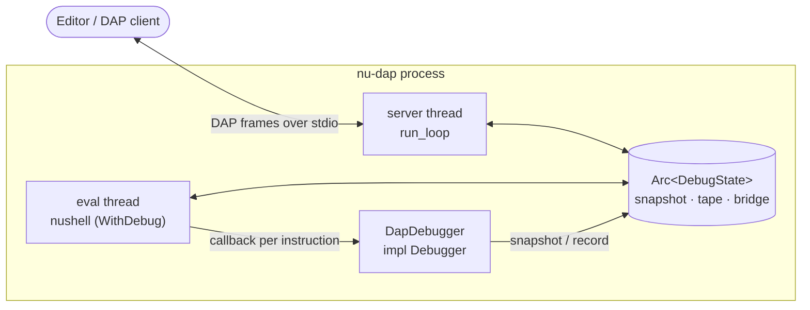
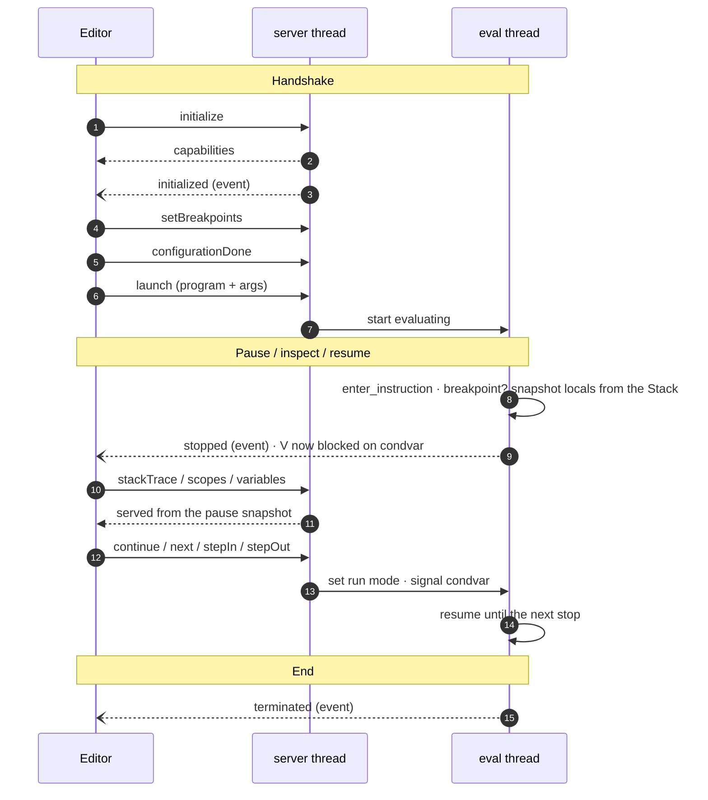
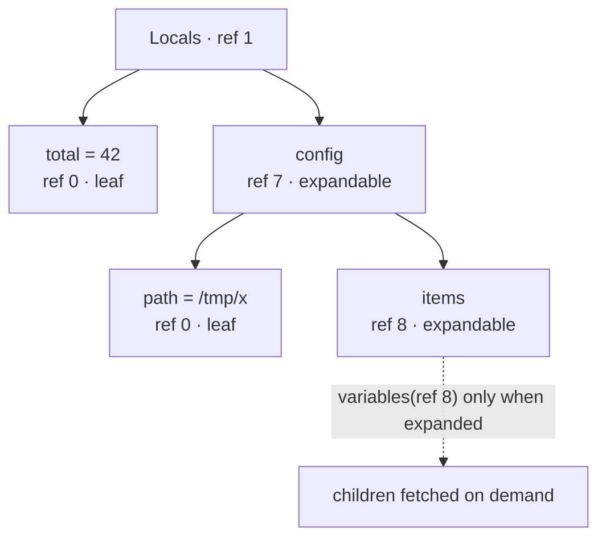

# nu-dap

A [Debug Adapter Protocol][dap] (DAP) server for Nushell scripts. It embeds the Nushell engine and speaks DAP over
stdio, so any DAP-capable editor — VS Code, Zed, Neovim, … — can debug a `.nu` script: breakpoints, stepping, variable
inspection, watch expressions, interactive prompts, and recorded time-travel.

The debugger is normally reached through the CLI:

```sh
nu --dap        # start the DAP server on stdin/stdout
```

[dap]: https://microsoft.github.io/debug-adapter-protocol/

---

## The Debug Adapter Protocol, in brief

DAP is the protocol behind VS Code's generic debugger UI (and its ports in Zed, Neovim, etc.). An **editor** talks to a
**debug adapter** — this crate — which drives the actual runtime. The parts that matter here:

- **Transport & framing.** JSON messages over a byte stream (our stdin/stdout), each prefixed with an HTTP-style header:

  ```
  Content-Length: 128\r\n\r\n{"seq":1,"type":"request","command":"initialize", …}
  ```

  `dap/protocol.rs` reads and writes these frames.

- **Three message types.**
    - `request` — the editor asks for something (`launch`, `setBreakpoints`,
      `stackTrace`, `continue`, …).
    - `response` — our reply to a request (`success` + a `body`).
    - `event` — something we push unprompted (`stopped`, `output`, `terminated`).

- **The handshake, then a loop.** The editor negotiates capabilities, sets breakpoints, and launches; from then on it is
  a request/response loop punctuated by events. When the program hits a breakpoint we emit `stopped`; the editor asks
  for `threads` → `stackTrace` → `scopes` → `variables` to paint its UI, then sends `continue`/`next`/`stepIn`/`stepOut`
  to resume us. The full lifecycle is the sequence diagram in [Flow of a debug session](#flow-of-a-debug-session).

- **The `variablesReference` tree.** DAP has no nested-value type. Instead every expandable value gets an integer
  handle; the editor calls `variables` with that reference to fetch the children, which may themselves carry references.
  A reference of `0` means "leaf, not expandable." We build this tree in
  `variables.rs` and hand out references lazily.

- **Capabilities.** In the `initialize` response we advertise exactly what we support, so the editor only surfaces
  working UI. The full breakdown — supported and not — is in [DAP capabilities](#dap-capabilities) below.

---

## DAP capabilities

What the adapter exposes today, from the DAP [`Capabilities`][caps] set — advertised in the `initialize` response so a
client only surfaces working UI. This adapter is **launch-only** (there is no `attach`).

### Supported

| Feature                          | Request / capability                                 | Notes                                                |
|----------------------------------|------------------------------------------------------|------------------------------------------------------|
| Breakpoints                      | `setBreakpoints`                                     | verified; snapped forward to the next runnable line  |
| Conditional breakpoints          | `supportsConditionalBreakpoints`                     | nu expression, evaluated in the scratch engine       |
| Logpoints                        | `supportsLogPoints`                                  | `{expr}` interpolation, emitted to the Debug Console |
| Exception breakpoints            | `exceptionBreakpointFilters` (`error`)               | pause on any raised error (incl. ones later caught)  |
| Exception info                   | `supportsExceptionInfoRequest`                       | error id + message (+ external stderr tail)          |
| Stepping                         | `continue` · `next` · `stepIn` · `stepOut` · `pause` | step-into walks pipe stages                          |
| Step back / reverse continue     | `supportsStepBack`                                   | recorded time-travel                                 |
| Stack trace / scopes / variables | `stackTrace` · `scopes` · `variables`                | lazy hydration; 5 scopes                             |
| Evaluate (watch / repl / hover)  | `supportsEvaluateForHovers`, `evaluate`              | scratch engine                                       |
| Configuration done               | `supportsConfigurationDoneRequest`                   | run deferred until breakpoints are set               |
| Restart                          | `supportsRestartRequest`                             | hot restart; breakpoints kept                        |
| Terminate / disconnect           | `supportsTerminateRequest`, `disconnect`             |                                                      |

### Not (yet) supported

| Feature                        | Capability                                                  | Why                                                             |
|--------------------------------|-------------------------------------------------------------|-----------------------------------------------------------------|
| Set variable                   | `supportsSetVariable`                                       | needs `&mut Stack` in the Debugger callbacks (upstream nushell) |
| Jump to cursor                 | `supportsGotoTargetsRequest`                                | needs a control-flow return from `enter_instruction` (upstream) |
| Function breakpoints           | `supportsFunctionBreakpoints`                               | not implemented (advertised `false`)                            |
| Hit-count breakpoints          | `supportsHitConditionalBreakpoints`                         | not implemented                                                 |
| Data / instruction breakpoints | `supportsDataBreakpoints`, `supportsInstructionBreakpoints` | out of scope                                                    |
| Set expression                 | `supportsSetExpression`                                     | out of scope (see set variable)                                 |
| Step-in targets                | `supportsStepInTargetsRequest`                              | not implemented                                                 |
| Completions                    | `supportsCompletionsRequest`                                | not implemented                                                 |
| Modules / loaded sources       | `supportsModulesRequest`, `supportsLoadedSourcesRequest`    | not applicable to nu                                            |
| Restart frame                  | `supportsRestartFrame`                                      | not implemented                                                 |
| Memory read/write, disassemble | `supportsReadMemoryRequest`, …                              | not applicable                                                  |
| Cancel                         | `supportsCancelRequest`                                     | not implemented                                                 |
| Breakpoint locations           | `supportsBreakpointLocationsRequest`                        | not implemented                                                 |
| Attach                         | `attach`                                                    | launch-only                                                     |

The two upstream-blocked rows — **set variable** and **jump to cursor** — are the notable "not yet": both need small
nushell core changes (a mutable `Stack`
in the debugger callbacks, and a control-flow return from `enter_instruction`).

[caps]: https://microsoft.github.io/debug-adapter-protocol/specification#Types_Capabilities

---

## Architecture

The adapter runs two threads over one shared state object.



The **server thread** answers read-only requests from the snapshot; the **eval thread** runs the script and, while
paused, is frozen on a condvar. They share only `DebugState` — never the live engine (see the concurrency rule below).

- **`server/`** — the DAP dispatcher (`run_loop` + a thin router, with handlers grouped by concern). It reads requests,
  mutates shared state (set breakpoints, choose a run mode, request resume), and answers read-only requests
  (`stackTrace`, `scopes`, `variables`, `evaluate`) from the snapshot the eval thread published at the last pause.

- **`engine.rs`** — builds the `EngineState`, registers the command shims, and spawns the **eval thread**, which parses
  the script and runs it with the debugger activated (`eval_block::<WithDebug>`). The IR evaluator calls our
  `Debugger` callbacks before every instruction.

- **`debugger/`** — `DapDebugger`, the `Debugger` impl. This is where stepping decisions, breakpoint checks, the pause
  loop, and snapshot building happen.

- **`state.rs`** — `Arc<DebugState>`: all cross-thread state, with its own locks.

### The concurrency rule (deadlock hazard)

The eval thread runs our `Debugger` impl **while holding
`EngineState.debugger`** (the IR evaluator takes that lock before every callback). Therefore the **server thread must
never touch
`EngineState.debugger`** — it would deadlock against a paused eval thread. All cross-thread communication goes through
`DebugState`, which lives in its own
`Arc` with independent locks. The server answers `stackTrace`/`variables`/… from a *snapshot* the eval thread copied
into `DebugState` at the pause, never by reaching into the live engine.

---

## Flow of a debug session



1. **Launch.** The editor sends `launch` with the script path and args. The eval thread parses the file, then runs the
   top-level block — followed by an entry point: `main` if defined, an explicitly chosen function (for libraries with no
   `main`), or nothing (top-level only).

2. **Per-instruction callbacks.** As the IR evaluator runs, it calls
   `enter_instruction` before each instruction. There we:
    - map the instruction's span to a source line (`source_map.rs`; only single-line spans are valid stop locations);
    - decide whether the current run mode or a breakpoint wants to pause here;
    - snapshot this frame's variables (see below) when we might pause, evaluate a condition/logpoint, or record for
      time-travel.

3. **Pause.** On a stop we build a `PauseSnapshot` (frames + all scopes) into
   `DebugState`, emit a `stopped` event, and **block the eval thread on a condvar**. The engine is now frozen
   mid-evaluation.

4. **Inspection.** While paused, the editor's `stackTrace`/`scopes`/`variables`/
   `evaluate` requests are answered by the **server thread** from that snapshot — no engine access.

5. **Resume.** A `continue`/`next`/`stepIn`/`stepOut` sets the run mode and signals the condvar; the eval thread wakes
   and evaluation continues until the next stop. When the script ends we drain its output and emit `terminated`.

---

## How "seeing variables" works

Showing variable values is a debugger's core job — and it's the one thing Nushell's `Debugger` trait historically
*couldn't* do: its callbacks never received the evaluator's `Stack`, where locals live. Older versions of this adapter
reconstructed values by watching the IR instruction stream (`store-variable`, argument pushes, …) — a "shadow model"
that was fragile and, for example, couldn't see a closure's own parameters.

[#18708][pr18708] removed that limitation upstream: the callbacks now receive
`&Stack`. So the reconstruction is gone. Whenever a value might be needed — a pause, a breakpoint condition, a
time-travel recording — `sync_locals_from_stack`
reads it directly from three sources:

- **Locals** — iterate `stack.vars` (a `Vec<(VarId, Value)>`), resolving each name from the variable's declaration span
  in the source. These are the *real*
  bindings, so closure parameters, command arguments, and `for`/`match` bindings all appear correctly — cases the old
  shadow model missed.
- **Environment** — `stack.get_env_vars()` yields the full runtime `$env`, including the mutations the script has made.
- **`$in`** — the one value *not* on the stack (it is register-based); captured from register 0 at block entry and
  injected alongside the locals.

Per the [concurrency rule](#the-concurrency-rule-deadlock-hazard), the eval thread copies these into `DebugState` at
each stop; the server then answers
`variables`/`evaluate` from that snapshot, never from the live engine.

[pr18708]: https://github.com/nushell/nushell/pull/18708

### Scopes

The `scopes` response exposes several roots, each a `variablesReference`:

| Scope         | What it holds                                                     |
|---------------|-------------------------------------------------------------------|
| **Locals**    | in-scope variables + a synthetic `return` (latest result) + `$in` |
| **Pipeline**  | the value flowing `in → <command>` at a pipe-stage boundary       |
| **Globals**   | `$nu` (config/paths/pid/os-info) and `$env`                       |
| **Registers** | the IR evaluator's raw working slots (`%0`, `%1`, …)              |
| **Process**   | rolling tails of the script's captured stdout/stderr              |

Nushell values can nest arbitrarily deep — a record holding a list of records, and so on. Serializing a whole tree on
every pause would be wasteful (most of it is never looked at) and could be huge. So the adapter hands values over
**lazily**, much like a file explorer only reads a folder's contents when you click to open it.

The mechanism is a handle. Every value the adapter sends carries an integer
`variablesReference`:

- A **leaf** — a number, string, or bool — has `variablesReference: 0`: nothing to expand.
- An **expandable** value — a record, list, or table — gets a non-zero handle *instead of* its contents.

When the session pauses, a scope like *Locals* returns only its **immediate**
children: the top-level variables, each expandable one as just a handle. The editor draws them, and the nested ones show
a ▸ disclosure triangle but aren't loaded yet. Only when you actually expand one does the editor send a `variables`
request carrying that handle, and the adapter replies with *that* node's immediate children — its expandables, again, as
fresh handles. Drill in further and the cycle repeats.

The payoff is there's **no depth limit**: nothing is flattened up front, so a record nested twenty levels deep costs
nothing until you navigate into it. For example, a `Locals` scope hands back leaves inline and expandables as handles:



Streams are *described* (kind/origin/size), never drained, so inspecting them can't consume the program's data.

---

## Time-travel (the "tape")

Nushell can't reverse-execute, so time-travel is **recorded state**, not replay. When enabled, `enter_instruction`
records a `TimelineEntry` (resolved frames + the locals/env snapshot) at every executed line into a bounded ring buffer.
`stepBack`/`reverseContinue` move a cursor over that tape and rebuild a past view — they never resume the eval thread;
only stepping past the live frontier resumes real execution. The rebuild happens on the server thread without the
engine, so the eval thread caches `$nu` and the baseline env for it.

---

## Process stdio ownership

An embedded engine's `print`, and any external command, write to the process's real stdout — which would corrupt the DAP
frame stream. `run_stdio` therefore takes ownership of process stdio (`stdio.rs`): it detaches child stdin to the null
device, swaps stdout/stderr for capture pipes, and sends DAP frames over a *duplicated* real stdout. Captured output is
forwarded to the editor as `output`
events. `print`/`input` are Nushell CLI commands (not library ones), so an embedded engine would treat them as
externals; `print_cmd.rs` registers replacements that route to DAP output and native editor prompts.

---

## Public API

The crate is a thin facade; everything else is `pub(crate)`.

```rust
// Default: speak DAP over this process's stdin/stdout, with full stdio setup.
// This is what `nu --dap` calls.
nu_dap::run_stdio();

// Transport-agnostic core: run the DAP loop over any BufRead + Write, for
// embedding behind a socket or pipe. Does no process-level stdio setup.
nu_dap::serve(reader, writer);
```

The `dap` module exposes the wire types (framing + request/response/event payloads) for integrators that build atop
`serve`.

---

## Module map

```
src/
  lib.rs          public API (run_stdio / serve) + the dap module
  main.rs         the `nu-dap` binary: fn main() { nu_dap::run_stdio() }
  server/         DAP dispatch — run_loop + a thin router; never locks the debugger
    mod.rs          run_loop, Session, the dispatch router
    lifecycle.rs    initialize, launch, configurationDone, restart, terminate/disconnect
    breakpoints.rs  setBreakpoints, setExceptionBreakpoints, exceptionInfo
    inspect.rs      threads, stackTrace, scopes, variables, evaluate
    stepping.rs     continue, next/stepIn, stepOut, pause
    timetravel.rs   stepBack, reverseContinue
    custom.rs       nuDapVisualize, nuDapUiReply
  debugger/       DapDebugger: the Debugger impl
    mod.rs          struct + trait impl (enter/leave block + instruction), pause loop
    snapshot.rs     build the pause snapshot (frames + scopes)
    stepping.rs     step-mode decisions + read locals/env from the Stack
  engine.rs       builds EngineState, registers shims, runs the script / entry point
  state.rs        Arc<DebugState>: breakpoints, run mode, snapshot, time-travel tape
  variables.rs    nu Value → DAP variable tree (lazy) + stream describe
  source_map.rs   span → file/line; single-line-span stop locations
  print_cmd.rs    print / input / input list command shims
  eval_scratch.rs separate engine for watch / condition / logpoint expressions
  stdio.rs        stdin detach + stdout/stderr capture pipes
  paths.rs        canonicalize + strip Windows \\?\ verbatim prefix
  dap/            protocol framing + typed payloads
  tests/          unit tests for the internal modules (paths, source_map, variables)
```

## Testing

```sh
cargo test -p nu-dap
```

Two layers: **unit tests** in `src/tests/` are compiled with the crate, so they exercise the internal (`pub(crate)`)
helpers directly; the **integration tests**
in the top-level `tests/dap.rs` drive the built binary over the real protocol (playing the editor side) against
`tests/fixtures/*.nu`. Some integration tests spawn `^python` as an external, so Python must be on `PATH`.

The fixtures are deliberately kept out of `example/`: assertions pin exact line numbers in them, so editing a fixture
for readability breaks the suite, whereas
`example/*.nu` is a showcase for users and free to change.
